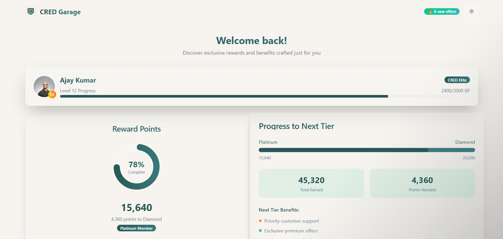

# 🚗 CRED Garage Inspired Dashboard

A **modern, responsive dashboard** inspired by **CRED Garage**, built with **React (Vite)**, **TailwindCSS**, **Framer Motion**, and **Recharts**.  
The project emphasizes clean UI/UX, animations, and component-based architecture using mock data.

---

## ✨ Features

- **User Profile Summary**
  - Avatar, Name, Level, XP Progress Bar
- **Benefits Section**
  - Interactive Claimable Benefit Cards
- **Reward Points Progress**
  - **Radial Progress (Recharts + Gradient)**
  - **Linear Tier Progress Bar**
- **Dark / Light Mode**
  - Persisted with `localStorage`
- **Smooth Animations**
  - Powered by **Framer Motion**
- **Local Mock Data**
  - No API or backend needed (`mocks/` folder)

---

## 🛠️ Tech Stack

| Tech              | Purpose                                |
| ----------------- | -------------------------------------- |
| **Vite + React**  | Frontend Framework                     |
| **TailwindCSS**   | Utility-First CSS Styling              |
| **Framer Motion** | UI Animations & Transitions            |
| **Recharts**      | Radial & Linear Progress Visualization |
| **React Context** | Global State Management                |

---

## 🗂️ Setup Instructions

### 1️⃣ Clone the Repository

```bash
git clone https://github.com/GoyalDhruv/Cred-Dashboard.git
cd Cred-Dashboard
```

### 2️⃣ Install Dependencies

```bash
npm install
```

### 3️⃣ Run the Development Server

```bash
npm run dev
```

## 🚀 Live Demo
### Deployed on Vercel: https://cred-dashboard-chi.vercel.app/


## 📷 Screenshots



